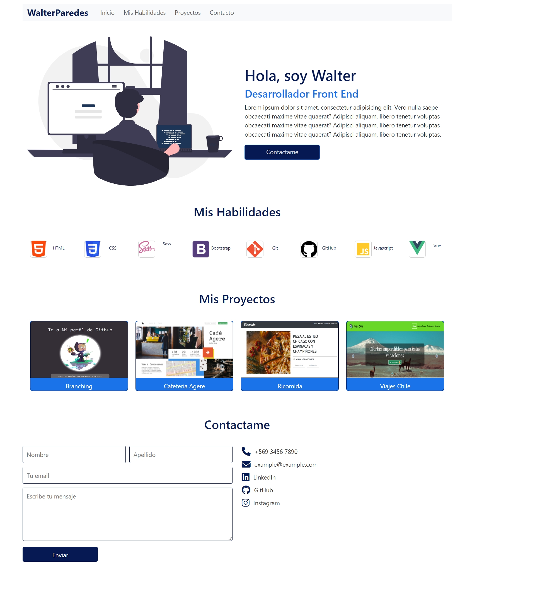
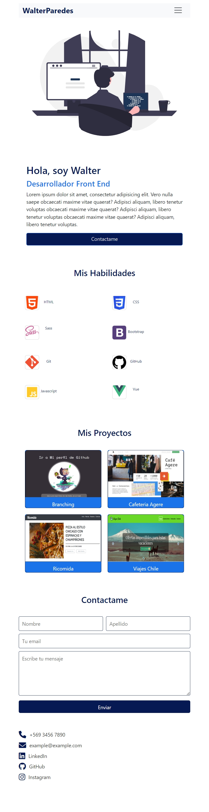

 
 <h1>Mi Primer Portafolio</h1>

    <p>El proyecto está orientado al cumplimiento de los siguientes indicadores.</p>

```htm
    <p></p>```

    <h2>Respecto a la escala de apreciación se realizó lo solicitado:</h2>
    <ul>
        <li>Se instaló Bootstrap mediante la terminal usando NPM.</li>
        <li>Se creó la estructura de carpetas que hemos estado revisando en los últimos proyectos.</li>
        <li>Se modificaron los colores predeterminados de Bootstrap, utilizando colores que se obtuvieron de colorhunt.co.</li>
        <li>Se logró utilizar la grilla de Bootstrap ajustando las vistas de acuerdo con lo solicitado.</li>
        <li>Se ajustó el menú de navegación para redireccionar a cada sección dentro de la página.</li>
        <li>Se creó un formulario de contacto que permite cotizar servicios. El formulario solicita como requerido los datos de contacto para poder enviar el mensaje.</li>
    </ul>

```htm
    <p></p>
```
